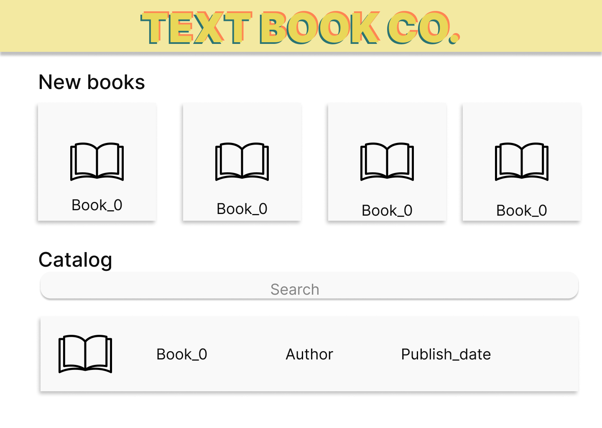
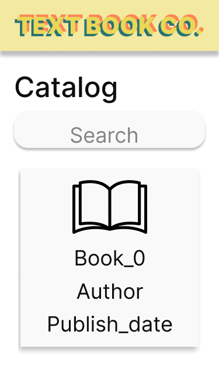
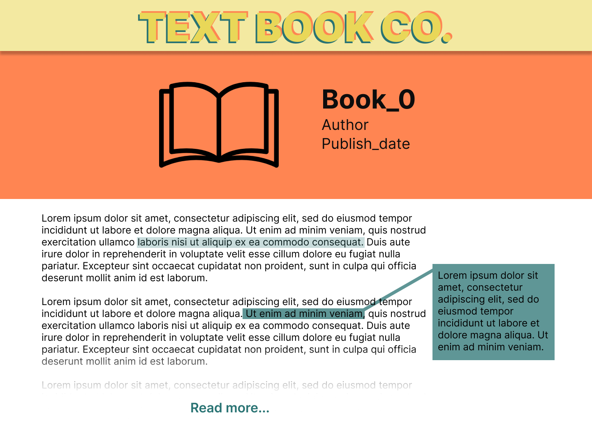
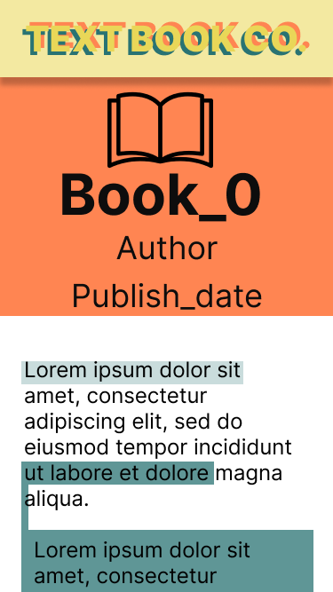

# Problem 1: Centering a Div (Simple)

Task:
Achieve div centering using various techniques to demonstrate proficiency in layout methods.

**Instructions:**
Utilize CSS layout properties to center a div element through different methods. Avoid reliance on external resources. Consider employing techniques like flexbox, CSS Grid, or positioning. Provide comments within your code explaining the rationale behind each approach and any potential drawbacks.

# Problem 2: Website Development

Task:
Develop a website according to provided specifications to showcase your web development skills.

**Instructions:**

1. Homepage Creation:
   - Design an appealing homepage displaying a list of books, adhering to responsive design principles for optimal viewing on diverse devices.
   - Implement both dark mode and light mode themes, ensuring seamless transitions based on user browser preferences for enhanced user experience.
   - Enhance user interaction with smooth page transitions using CSS animations or JavaScript libraries, considering loading times for a seamless browsing experience.
   - Display a loading indicator until all data from the API is fetched.

   
   

2. Book Page:
   - Develop a dedicated book page with advanced functionalities for improved user engagement.
   - Enable users to highlight text passages within the book content, incorporating intuitive UI elements for easy text highlighting.
   - Allow users to interact with highlighted text segments, including copying or modifying associated comments.
   - Implement a filtering mechanism for users to search and display text passages containing specific keywords, optimizing for efficient performance.
   - Ensure accessibility features such as keyboard navigation and screen reader compatibility are integrated.

**Additional Features:**
- Utilize responsive design principles to ensure dynamic adjustment across various screen sizes and orientations using media queries and fluid layout techniques.
- Improve website performance and user experience through resource optimization, minimizing HTTP requests, and leveraging caching mechanisms.
- Enhance visual effects and user interactions using advanced CSS techniques like transitions and transforms.
- Engage users with interactive elements such as animations or widgets for a more immersive browsing experience.
- Follow best practices for code organization, maintainability, and scalability, including modular CSS architecture and reusable JavaScript components. Ensure code readability and documentation for ease of maintenance and future updates.

   
   